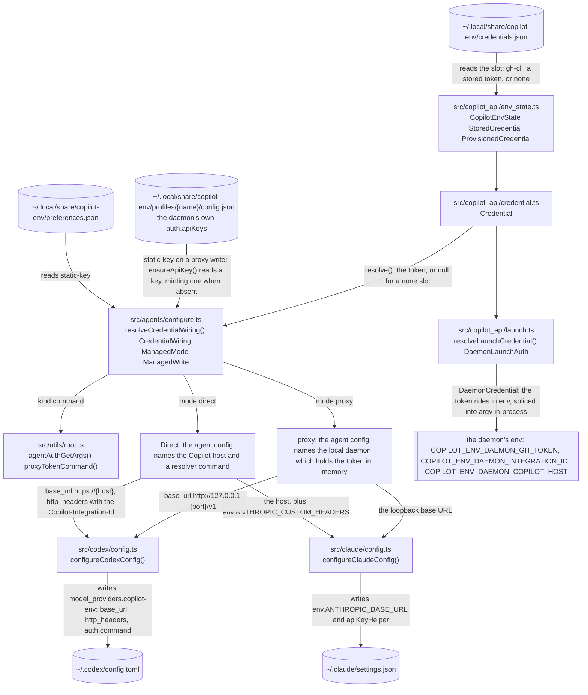
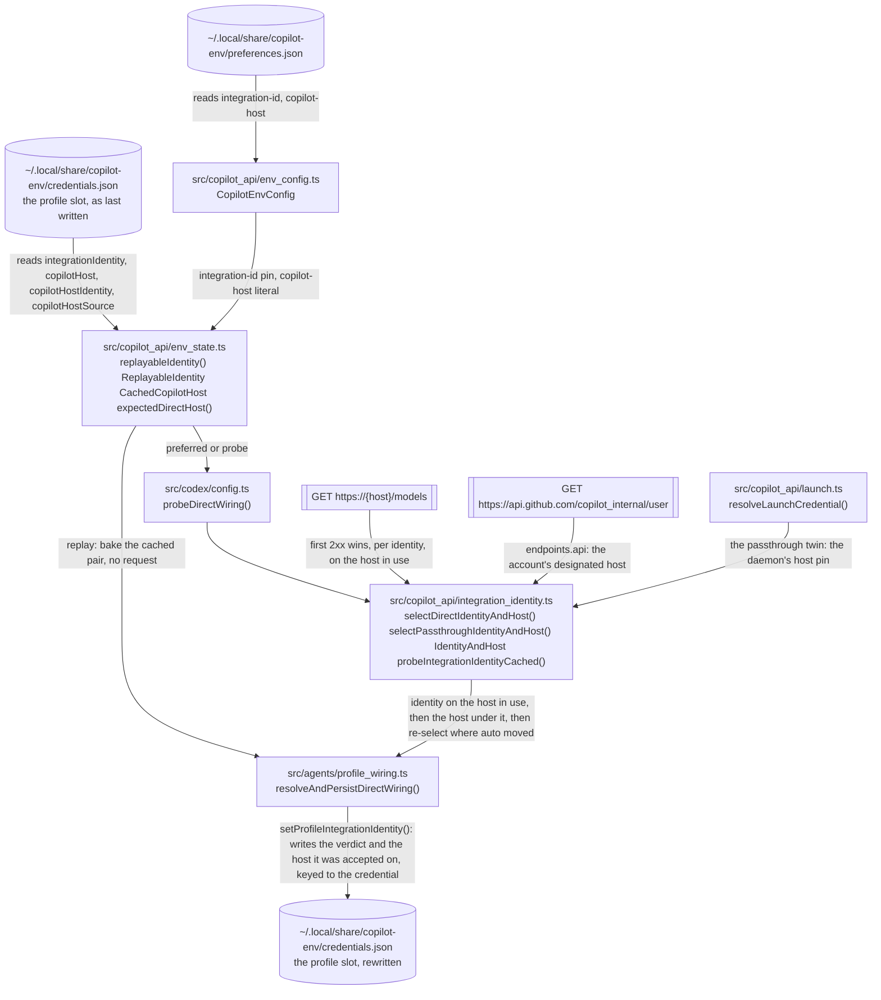
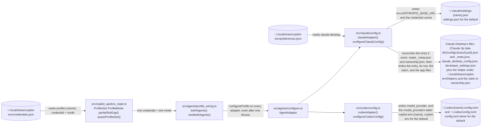
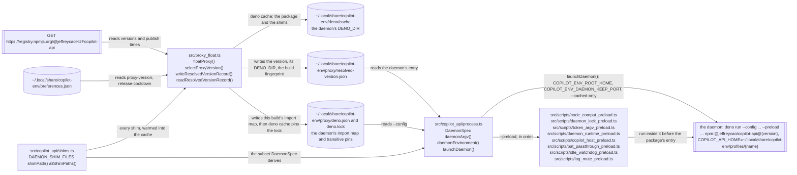
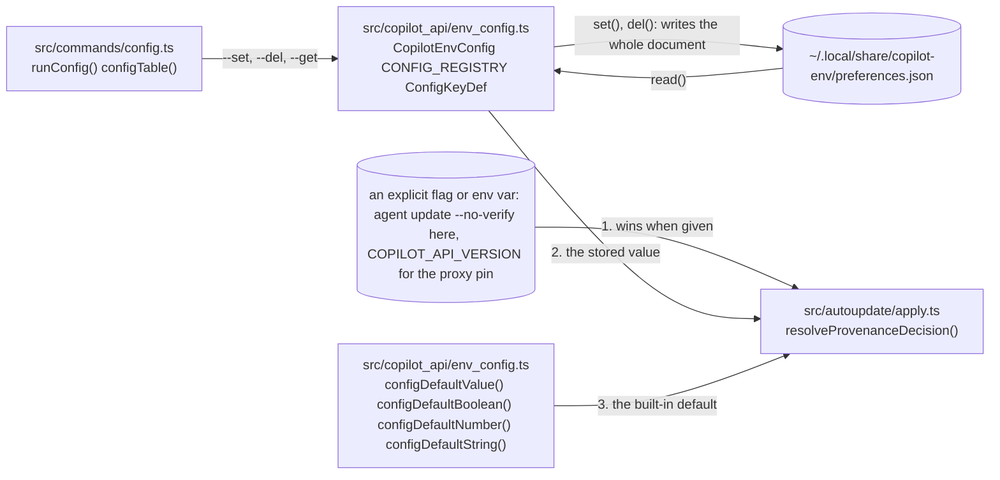
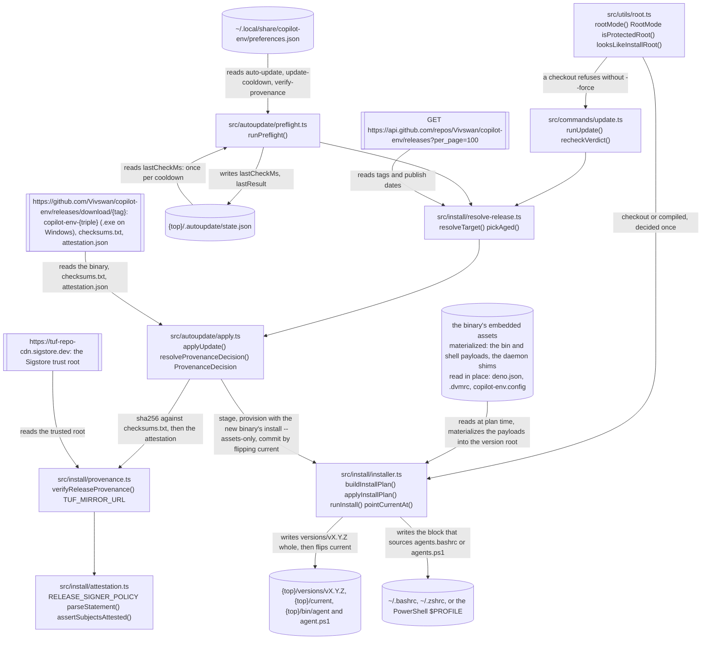
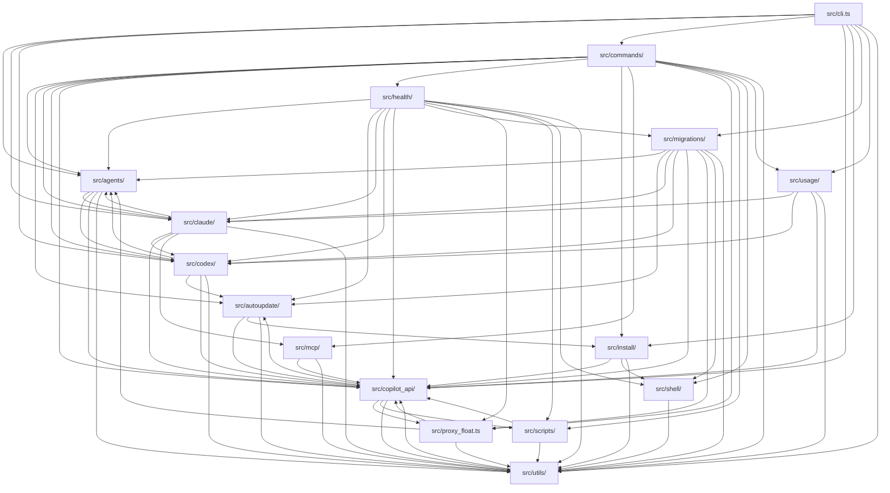

# Architecture

How copilot-env's code is arranged: the decisions a reader would otherwise reverse, each as one diagram over real files, then the layer map. Not a user guide (the other pages are), and the checks behind it prove existence only: every path a box names exists, every symbol after a path is exported by that file, and every `Demonstrated by:` link resolves. No check tests the claim a diagram makes.

Every concept diagram starts at what the flow reads and ends at what it writes or launches. A cylinder is a file or store on this machine, a double-edged box is a network endpoint or a process, and a plain box is code; `{name}`, `{host}`, `{top}` stand for the profile, the Copilot host, and the install root.

## The two wiring modes and the one credential

- **No implicit `gh` fallback:** a `none` slot resolves to null and the caller asks (`agent auth`); a named profile's reason names the profile.
- **`static-key` is the one opt-in that bakes the value:** `resolveCredentialWiring()` resolves it once per agent at the write, and the file then carries the value (`http_headers.Authorization` for Codex, `env.ANTHROPIC_AUTH_TOKEN` for Claude) instead of the resolver command. An unresolvable static credential is a failed write, never a silent return to the command shape.

Demonstrated by: [test/configure.test.ts](../test/configure.test.ts), [test/auth.test.ts](../test/auth.test.ts), [test/codex_config.test.ts](../test/codex_config.test.ts).

## Identity and host: one pair, one replay rule

- **The probe memo is process-lifetime and never invalidated** (`probeIntegrationIdentityCached()`): a CLI run ends in seconds, and the MCP server keeps its verdict until the transport closes. Injected I/O and a caller deadline bypass it.
- **A pin is configuration, never a verdict:** the slot keeps what it held, so `--identity auto` returns to it; a credential change clears the slot.

Demonstrated by: [test/integration_identity.test.ts](../test/integration_identity.test.ts), [test/copilot_host.test.ts](../test/copilot_host.test.ts).

## Profiles are atomic units

- **No fallback** ([authentication: profiles](authentication.md#profiles) owns the rule): `Credential.resolveWithReason()` names the profile in its reason, and a launch on a partial slot reports `partialSlotGap()` instead of guessing.
- **The default is a profile too,** under the reserved `default` key. For a named profile `mode` is the truth its artifacts derive from; for the default, `mode` records what the wiring last wrote (`recordDefaultModeFromWiring()` in `src/agents/configure_defaults.ts`) and the artifacts stay the live truth.

Demonstrated by: [test/profiles.test.ts](../test/profiles.test.ts), [test/codex_profile_wiring.test.ts](../test/codex_profile_wiring.test.ts).

## The proxy floats; runtime needs are preload shims

- **We never patch the package:** every shim wraps a runtime seam (`globalThis.fetch`, `fs.createWriteStream`, `process.argv`) and touches none of copilot-api's files, so none of them pins the floated version.
- **`--cached-only` at spawn gives no second chance,** which is why the float warms the cache; the spawn's subset means a credential-less daemon carries no token shim.
- **The secret-carrying shims stay import-free** (`test/lint/no_shim_imports.ts`): a runtime import would drag CLI modules into the daemon process.

Demonstrated by: [test/proxy_float.test.ts](../test/proxy_float.test.ts), [test/daemon_spawn.test.ts](../test/daemon_spawn.test.ts), [test/daemon_env_keys.test.ts](../test/daemon_env_keys.test.ts).

## The config store: flag, then stored, then default

- **Every read site applies the precedence itself;** `resolveProvenanceDecision()` is one of them, taking the flag and the resolved key as two arguments so no stage re-derives the answer.
- **`CopilotEnvConfig.read()` is strict:** an unreadable store throws, because wiring, the proxy pin, and the port knobs must never act on an unproven empty. The three accessors the daemon-side gates reach read degraded instead (`autoStartEnabled()`, `autoUpdateEnabled()`, `idleTimeoutSeconds()`): a throw there would kill the serving daemon, and their flatten is the safe direction (lifecycle off, default window, no self-update).
- **One registry** (`CONFIG_REGISTRY`) owns each key's CLI name, storage key, parser, default, and description; [docs/configuration.md](configuration.md) is pinned against it by `test/docs_config.test.ts`.

Demonstrated by: [test/env_config.test.ts](../test/env_config.test.ts), [test/update_apply.test.ts](../test/update_apply.test.ts).

## Install, update, provenance

- **Trust on first use:** the installer never verifies the release it was fetched from (that would be circular). `agent update` proves origin with Sigstore and fails closed; `--no-verify` and the `verify-provenance` key are the two opt-outs, and the skip warning names the way back.
- **Nothing before the commit is best-effort;** past the `current` flip the install has moved forward, so `agent migrate` and the GC (one previous version kept) may fail without stranding it.

Demonstrated by: [test/installer.test.ts](../test/installer.test.ts), [test/update_apply.test.ts](../test/update_apply.test.ts), [test/provenance.test.ts](../test/provenance.test.ts).

## The launch path

```mermaid
flowchart LR
  rcfile[("~/.bashrc, ~/.zshrc, or the PowerShell $PROFILE")]
  settings[("~/.claude/settings.json<br>settings-{name}.json for a profile")]
  prefs[("~/.local/share/copilot-env/preferences.json")]
  env["src/commands/env.ts<br>launcherFunctionLines() runEnv()"]
  rc["shell/agents.bashrc<br>shell/agents.ps1"]
  bin["bin/agent<br>bin/agent.ps1"]
  cli["src/cli.ts"]
  launch["src/commands/launch.ts<br>parseLaunchAction() prepareLaunch() commandDeps() runLaunch() LaunchPlan"]
  token["src/commands/proxy_token.ts<br>resolveProxyToken() launchProxy()"]
  wire["src/agents/profile_wiring.ts<br>wireBothAgents()"]
  daemonproc[["agent start, a child, when the proxy is down"]]
  configs[("~/.codex/config.toml and ~/.claude/settings.json<br>the profile's pair for a named launch")]
  agentcli[["the agent CLI: claude, codex, or copilot, a child with inherited stdio"]]
  rcfile -->|"the copilot-env block sources it"| rc
  settings -->|"reads the wired base URL: managedClaudeBaseUrl()"| env
  prefs -->|"reads codex-home, codex-host, launchers"| env
  env -->|"the only output the agent function evals: CODEX_HOME, ANTHROPIC_BASE_URL, the cl co cx functions"| rc
  rc -->|"cl runs agent launch claude with the arguments"| bin
  bin --> cli
  cli --> launch
  launch -->|"ensureProxy"| token
  launch -->|"syncProfileWiring"| wire
  token -->|"launchProxy(): spawns it"| daemonproc
  wire -->|"rewrites"| configs
  launch -->|"LaunchPlan: command, args, env, scrub"| agentcli
```

- **The managed values are re-read after wiring, never taken from the shell:** the wiring step may have moved a port or built the Codex host farm, and nothing refreshes the shell's env between wiring and exec inside one process. The rest of the environment passes through.
- **No execve:** the agent runs as a child and its exit code (or 128 + signal) passes through; the wiring's write reports are deferred until the agent hands the terminal back.

Demonstrated by: [test/launch.test.ts](../test/launch.test.ts), [test/env.test.ts](../test/env.test.ts), [test/shell_integration.test.ts](../test/shell_integration.test.ts).

## The module map

Each node is one layer, labelled with the paths it owns; an arrow means the layer imports the other. Rendered from `architecture.json` by `deno task docs:arch` (`--check` fails on drift), and the lint in `test/architecture.test.ts` keeps that declaration equal to the import graph under `src/`:

| Lint message                                                                     | What to do                                                                 |
| -------------------------------------------------------------------------------- | -------------------------------------------------------------------------- |
| `forbidden import a -> b: src/a/x.ts -> src/b/y.ts; move it or declare the edge` | Move the import, or add `b` under `edges.a` when the dependency is right   |
| `stale allowance a -> b: no file draws it; remove it from architecture.json`     | Delete `b` from `edges.a`; the declaration lists only edges the code draws |
| `src/z.ts belongs to no layer in architecture.json`                              | Add the file to a layer or to `exclude`; nothing is dropped silently       |
| `layer a names src/a/, which owns no file of the graph`                          | Fix the path, or delete it from `layers`                                   |

An edge is any relative import: runtime, type-only, re-export, side-effect, or a string-literal `import()`. Imports inside one layer are not edges, and a layer absent from `edges` imports nothing outside itself.

<!-- BEGIN GENERATED: architecture-map (deno task docs:arch; derived from architecture.json) -->

<!-- END GENERATED: architecture-map -->
