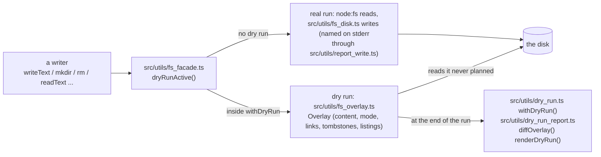

# Dry-run filesystem

How `--dry-run` keeps every read and write of a command on one seam, so a dry run reads the state it planned and prints a diff of it. This page owns the facade's design and its API; the writers move onto it in stacked PRs (Delivery, below). Not a user guide: `--dry-run` itself is documented with the commands that take it.

## One seam

Every filesystem call the CLI makes goes through `src/utils/fs_facade.ts`: `readText`, `writeText`, `stat`, `lstat`, `readdir`, `mkdir` (always `-p`), `rm`, `chmod`, `rename`, `exists`, and the rest of the table below. Synchronous and node:fs-shaped: the codes on the thrown errors (`ENOENT`, `EEXIST`, `EISDIR`, `ENOTDIR`) are the platform's own, so a caller's catch logic reads the same in both modes.



Demonstrated by: [test/fs_facade.test.ts](../test/fs_facade.test.ts).

## Writers go back to their original shape

The Claude settings writer, in its three shapes; the middle one is what main spells today (`src/claude/config.ts`, `planClaudeConfig`):

```text
before the plan API:
  writeFileReported(settingsPath, `${JSON.stringify(doc, null, 2)}\n`, { detail });

with the plan API (main today; the command hands the plan to landPlan):
  return {
    files: [{
      path: settingsPath,
      verdict: textVerdict(before, text),
      attributes: planPatch(doc, ops, SETTINGS_SECRETS),
      before,
      content: text,
    }],
    apply() {
      mkdirReported(claudeHome);
      writeFileReported(settingsPath, text, { detail });
    },
  };

with the facade:
  fs.mkdir(claudeHome);
  fs.writeText(settingsPath, text, { secretKeys: SETTINGS_SECRETS, detail });
```

A writer reads, computes, and writes; the dry run rides on the seam. The one change from the first shape is that reads (`exists`, `stat`, `readdir`) go through the same seam, which is what lets the overlay answer them.

## The API

Every module under `src/` reads and writes files through `import * as fs from "../utils/fs_facade.ts"`. Reads pass through to node:fs outside a dry run; writes land through `src/utils/fs_disk.ts`, which names each one on stderr (deduped per path, silent inside copilot-env's homes and under a scratch dir). Errors are node's own (`ENOENT`, `EEXIST`, `EISDIR`, `ENOTDIR`, `ENOTEMPTY`, `ERR_FS_EISDIR`) in both modes.

| Call                                                         | What it does                                                                                                                                                                                                               |
| ------------------------------------------------------------ | -------------------------------------------------------------------------------------------------------------------------------------------------------------------------------------------------------------------------- |
| `fs.dryRunActive()`                                          | true inside `withDryRun` (`src/utils/dry_run.ts`), and under the plan collector while the bridge stands                                                                                                                    |
| `fs.readText(p)` / `fs.readBytes(p)`                         | the file's text (utf8) / bytes                                                                                                                                                                                             |
| `fs.readTextResult(p)`                                       | `{ kind: "text", text }`, `{ kind: "absent" }` (lstat's own ENOENT/ENOTDIR), or `{ kind: "unreadable", error }` (a dangling link, EACCES): a destructive caller acts on `absent` alone                                     |
| `fs.stat(p)` / `fs.lstat(p)`                                 | `EntryStats` (`isFile`, `isDirectory`, `isSymbolicLink`, `mode`, `size`, `mtimeMs`); `stat` follows links                                                                                                                  |
| `fs.exists(p)`                                               | whether a lookup succeeds                                                                                                                                                                                                  |
| `fs.readdir(p)` / `fs.readdirEntries(p)`                     | names / `DirEntry` (`name`, `isFile`, `isDirectory`, `isSymbolicLink`; the link itself)                                                                                                                                    |
| `fs.readlink(p)` / `fs.realpath(p)`                          | a link's target text / the canonical path as the OS spells it (`realpathSync.native`: a Windows junction or 8.3 short name resolves)                                                                                       |
| `fs.writeText(p, text, opts?)`                               | atomic by default (staged beside the target, fsynced, renamed over it, the parent made); `opts`: `mode`, `atomic: false` (write in place, through a link), `detail`, `secretKeys`, `secret`                                |
| `fs.writeBytes(p, bytes, opts?)`                             | the same for bytes (`mode`, `atomic`, `detail`)                                                                                                                                                                            |
| `fs.copyFile(from, to, detail?)`                             | the bytes of `from` land at `to`                                                                                                                                                                                           |
| `fs.mkdir(p, { mode?, detail? })`                            | always `-p`; names each directory it makes                                                                                                                                                                                 |
| `fs.rm(p, { recursive?, force?, detail? })`                  | node's `rmSync`: a directory needs `recursive` (`ERR_FS_EISDIR`), an absent path needs `force` (`ENOENT`); returns whether anything was there                                                                              |
| `fs.rmdir(p)`                                                | node's `rmdirSync`: an empty directory (or a Windows junction) goes; `ENOTEMPTY`, `ENOTDIR`, `ENOENT` otherwise                                                                                                            |
| `fs.chmod(p, mode, detail?)`                                 |                                                                                                                                                                                                                            |
| `fs.rename(from, to)`                                        | across devices, copy then remove                                                                                                                                                                                           |
| `fs.symlink(target, p, type?)`                               | node's `symlinkSync` (`"junction"` on Windows)                                                                                                                                                                             |
| `fs.atomicSymlink(target, link)`                             | built aside and renamed over `link`; a directory there is the rename's own refusal (`EISDIR`; `EPERM` on Windows)                                                                                                          |
| `fs.openWritable(p, detail?)` / `fs.openWriteFd(p, detail?)` | a write handle (`Promise<Deno.FsFile>` / a node fd), created or truncated at the open; a dry run refuses one outside scratch                                                                                               |
| `fs.scratchDir(prefix)` / `fs.removeScratchDir(dir)`         | a process-transient directory (`ScratchDir`): real in every mode (a probe's throwaway config must exist for the CLI it spawns), never reported, never planned; a move or copy is real only when both its paths are scratch |
| `RenameRefusedError`                                         | the one failure a caller may answer with a direct write (`atomic: false`)                                                                                                                                                  |

Secrets are declared at the write. `secretKeys` names the dotted leaves of a JSON or TOML file whose values print as `<redacted>` for the path's whole run (`fs.writeText(settingsPath, text, { secretKeys: SETTINGS_SECRETS })`); `secret: true` marks the whole file (a settings bundle, the Codex `config.toml` with a baked key, the Claude Desktop config), which prints its verdict alone. A declaration travels with the file through `rename` and `copyFile`, so the report at the new path redacts the same values. Nothing is redacted at read time, and no reader re-derives a secret.

What replaces each `src/utils/report_write.ts` wrapper (the wrappers stay as thin aliases until every caller has moved; then they go):

| Wrapper                                                                                                  | Facade call                                                                                                                                                      |
| -------------------------------------------------------------------------------------------------------- | ---------------------------------------------------------------------------------------------------------------------------------------------------------------- |
| `writeFileReported(p, text, { mode, detail, secret })`                                                   | `fs.writeText(p, text, { mode, detail, secret, atomic: false })` (drop `atomic: false` unless the file may be a user's symlink or another process holds it open) |
| `writeFileReported(p, bytes)`                                                                            | `fs.writeBytes(p, bytes, { atomic: false })`, or `fs.copyFile`                                                                                                   |
| `atomicWriteFile(p, text, mode, detail, { secret })`                                                     | `fs.writeText(p, text, { mode, detail, secret })`                                                                                                                |
| `copyFileReported(from, to, detail)`                                                                     | `fs.copyFile(from, to, detail)`                                                                                                                                  |
| `mkdirReported(p, mode, detail)`                                                                         | `fs.mkdir(p, { mode, detail })`                                                                                                                                  |
| `chmodReported(p, mode, detail)`                                                                         | `fs.chmod(p, mode, detail)`                                                                                                                                      |
| `removeReported(p, detail)`                                                                              | `fs.rm(p, { force: true, detail })` (a directory is `ERR_FS_EISDIR`, no longer the wrapper's own message)                                                        |
| `removeTreeReported(p, detail)`                                                                          | `fs.rm(p, { recursive: true, force: true, detail })` (a path under a regular file is `ENOTDIR`, no longer `false`)                                               |
| `removeEmptyDirReported(p)`                                                                              | `fs.rmdir(p)` (an absent path is `ENOENT`, no longer silent)                                                                                                     |
| `renameReported(from, to)`                                                                               | `fs.rename(from, to)`                                                                                                                                            |
| `symlinkReported(target, p, type)`                                                                       | `fs.symlink(target, p, type)`                                                                                                                                    |
| `atomicSymlink(target, link)`                                                                            | `fs.atomicSymlink(target, link)`                                                                                                                                 |
| `openWritableReported` / `openWriteFdReported`                                                           | `fs.openWritable` / `fs.openWriteFd`                                                                                                                             |
| `scratchDir` / `removeScratchDir`                                                                        | `fs.scratchDir` / `fs.removeScratchDir`                                                                                                                          |
| raw `existsSync`, `readFileSync`, `statSync`, `lstatSync`, `readdirSync`, `readlinkSync`, `realpathSync` | the read of the same name above                                                                                                                                  |
| `readPlannedText(p)`, `shadowedText(p)`, `readPlannedDir(d)`, `plannedLook(p)`                           | `fs.readText` / `fs.exists` / `fs.readdir` / `fs.stat`: the seam answers overlay-first                                                                           |
| `readTextResult(p)` (`src/utils/fs.ts`)                                                                  | `fs.readTextResult(p)`                                                                                                                                           |

The stderr ledger stays in `src/utils/report_write.ts`: `reportWrite` (a mutation made through another API), `hideWritesUnder`, `deferWriteReports`, `flushWriteReports`. The marker a dry run hands its children (`COPILOT_ENV_DRY_RUN`, `underDryRunMarker`, `spawnedByDryRun`) lives in `src/utils/dry_run.ts` beside `withDryRun`, unchanged in behaviour.

## The transition bridge

Writers move onto the facade one PR at a time while `--dry-run` still runs under the plan collector (`collectDryRun`, `src/utils/write_session.ts`). Until the collector switches to `withDryRun`, the facade bridges to the plan machinery whenever the plan collector is active and no overlay is.

Writes land as the plan rows today's writers land:

- `writeText` on a JSON or TOML file yields `planDocReplace` rows (every leaf before and after, in document order, the `secretKeys` redacted) when the writer passes `secretKeys`; an empty list counts, as the declaration that the file is a document. Its verdict is the byte comparison (`unchanged` for a same-content re-render); a document that does not parse prints its path alone.
- `secret: true` yields the path alone; other text, or a write with no `secretKeys`, yields the line diff the wrappers land today.
- `mkdir`, `rm`, `rmdir`, `rename`, `chmod`, `symlink`, `copyFile` land the rows the wrappers land today and take the same refusals.

Reads answer from the plan's shadows first:

- `readText` is `readPlannedText`; `exists`, `stat`, `lstat`, and `readdir` see a planned path as present and a planned deletion as absent (an absent, unplanned directory is `ENOENT`).
- A directory the run removed and made again is fresh: present, and listing nothing the disk holds under it; `mkdir` over a planned deletion plans the directory instead of trusting the disk.
- A byte write, a copy, a chmod, or a link the plan holds without its content is present, and its bytes read from the disk; a copy carries the source's text (as the run sees it) to the run's later readers.
- A planned `chmod`, or a write's explicit `mode`, shows in `stat().mode`; a staged write without one shows the fresh inode's default.
- `readlink` and `realpath` read the disk: the plan holds no link targets.

The bridge is marked as such in the code and goes with `write_session.ts` when the collector switches; the facade then works as the overlay section describes. One caveat the bridge cannot hide: a writer that landed `planPatch` rows today (in patch order) lands `planDocReplace` rows through the facade (in document order), which is the order the tree diff prints too.

## The overlay

A dry run writes into an in-memory layer keyed by canonical path; a read answers from the layer first and the disk second.

| The run did               | A later read sees                                                                                                                                                 |
| ------------------------- | ----------------------------------------------------------------------------------------------------------------------------------------------------------------- |
| `writeText(p)`            | the planned text; `stat` reports its size, and the disk's mode unless the write named one, `p` is new, or the write is staged (a fresh inode at the default mode) |
| `rm(p)` (a tombstone)     | nothing: `readText` is `ENOENT`, `exists` false, `readdir` of the parent omits it                                                                                 |
| `rm -r d; mkdir d`        | an empty `d`: a directory made fresh hides everything the disk holds under it                                                                                     |
| `chmod(p)` on a disk file | the disk's bytes, carried by path, with the new mode                                                                                                              |
| `rename(a, b)`            | `b` holds the whole subtree of `a` (planned text, disk files by path, links as links), `a` is gone                                                                |
| `readdir(d)`              | the disk's names, plus the layer's creates, minus its tombstones                                                                                                  |

Errors the planned state alone determines are mirrored with the platform's own codes: a write onto a planned directory is `EISDIR`, a `mkdir` under a planned file `ENOTDIR`, an `rm` of a tombstoned path `ENOENT`, a rename into its own subtree `EINVAL`. A rename onto an existing destination replaces it without a refusal: every writer moves onto a path it has cleared or that was never there.

Windows differs where its node:fs does: a lookup under a file is `ENOENT`, a staged write onto a directory surfaces the `RenameRefusedError` the installer answers. The code Windows raises for a rename whose destination parent is a file is unverified; no writer issues one.

Modes land as Deno lands them: a file's explicit mode exactly, a directory's and every default with the umask applied. Windows keeps one bit: `0666` for anything writable, `0444` otherwise, so a `chmod 0700` there is no change.

Keys are canonical paths, so an alias and its target are one entry and a read through either sees the planned state; a staged write lands over the link itself. The report prints the path the run spelled.

A link the run plans (`symlink`, `atomicSymlink`, or a disk link a `rename` moves) is a `link` entry: a lookup through it restarts at its target, `lstat` and `readdir` see the link, and `readlink` reads its target text. The report says `create`, `rewrite` (anything else at the path), or `same` (a disk link with the same target).

**Accepted residual:** permission-class failures (`EACCES`, `ENOSPC`) are not simulated. A dry run reports what the real run would attempt; at most one cheap access probe may be added, nothing more.

## The report is a tree diff

At the end of the run every touched path is compared with the disk, in first-touch order (an entry a tree removal dropped and a later write re-created takes the later place):

- **Verdict** per path: `create`, `rewrite`, `same` (printed `unchanged`), `delete`; a directory carries a trailing separator. A file rewritten with its own bytes is `same`; a mode-only change is a `rewrite` with no row; a path created and deleted within the run prints nothing; a tree removed is one `delete` row.
- **Attribute rows** for `.json` and `.toml` files: every leaf keyed by dotted path (`model_providers.copilot-env.base_url`, `env.ANTHROPIC_BASE_URL`) with status `set`, `change`, `same`, or `remove`, printed as `key  old -> new`. A writer names the keys to redact on its write (`secretKeys`); those print `<redacted>` for the path's whole run.
- **Text rows** for every other planned text (an rc block, a helper script): the changed lines as `- old` and `+ new`; past 40 changed lines, a count. A declared-secret file with no leaf rows, a file declared `secret` as a whole, a planned link, and a disk file carried by path print their verdict alone.
- **Nothing touched** prints `Nothing would be written.`

## Delivery

Three waves:

1. The facade PR lands the seam complete (every call above, the bridge, the marker beside it, `atomicSymlink` and a link-honest overlay, the per-file secret flag) with every writer still on the wrappers and the plan API intact, so its dry-run output is main's.
2. The rewire PRs move the writers (`src/agents`, `src/claude`, `src/codex` in one; the rest of `src/` in the other) onto the calls above and stack on it.
3. The last PR switches `src/commands/dry_run.ts` to `withDryRun`, deletes `write_session.ts`, `write_plan.ts`, the wrappers and the bridge, and extends the fs lint from raw writes to raw reads.
