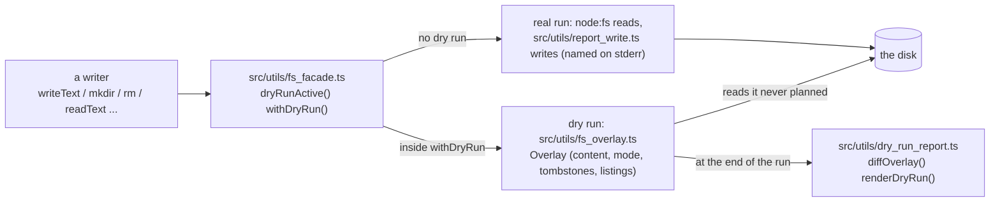

# Dry-run filesystem

How `--dry-run` will keep every read and write of a command on one seam, so a dry run reads the state it planned and prints a diff of it. This page owns the facade's design; the modules exist and are tested, and no command is wired to them yet. Not a user guide: `--dry-run` itself is documented with the commands that take it.

## One seam

Every filesystem call the CLI makes goes through `src/utils/fs_facade.ts`: `readText`, `writeText`, `stat`, `lstat`, `readdir`, `mkdir` (always `-p`), `rm`, `chmod`, `rename`, `exists`. Synchronous and node:fs-shaped: the codes on the thrown errors (`ENOENT`, `EEXIST`, `EISDIR`, `ENOTDIR`) are the platform's own, so a caller's catch logic reads the same in both modes.



Demonstrated by: [test/fs_facade.test.ts](../test/fs_facade.test.ts).

## Writers go back to their original shape

The Claude settings writer, in its three shapes; the middle one is what main spells today (`src/claude/config.ts`, `planClaudeConfig`):

```text
before the plan API:
  writeFileReported(settingsPath, `${JSON.stringify(doc, null, 2)}\n`, { detail });

with the plan API (main today; the command hands the plan to landPlan):
  return {
    files: [{
      path: settingsPath,
      verdict: textVerdict(before, text),
      attributes: planPatch(doc, ops, SETTINGS_SECRETS),
      before,
      content: text,
    }],
    apply() {
      mkdirReported(claudeHome);
      writeFileReported(settingsPath, text, { detail });
    },
  };

with the facade:
  fs.mkdir(claudeHome);
  fs.writeText(settingsPath, text, { secretKeys: SETTINGS_SECRETS, detail });
```

A writer reads, computes, and writes; the dry run rides on the seam. The one change from the first shape is that reads (`exists`, `stat`, `readdir`) go through the same seam, which is what lets the overlay answer them.

## The overlay

A dry run writes into an in-memory layer keyed by canonical path; a read answers from the layer first and the disk second.

| The run did               | A later read sees                                                                                                                                                 |
| ------------------------- | ----------------------------------------------------------------------------------------------------------------------------------------------------------------- |
| `writeText(p)`            | the planned text; `stat` reports its size, and the disk's mode unless the write named one, `p` is new, or the write is staged (a fresh inode at the default mode) |
| `rm(p)` (a tombstone)     | nothing: `readText` is `ENOENT`, `exists` false, `readdir` of the parent omits it                                                                                 |
| `rm -r d; mkdir d`        | an empty `d`: a directory made fresh hides everything the disk holds under it                                                                                     |
| `chmod(p)` on a disk file | the disk's bytes, carried by path, with the new mode                                                                                                              |
| `rename(a, b)`            | `b` holds the whole subtree of `a` (planned text, disk files by path), `a` is gone                                                                                |
| `readdir(d)`              | the disk's names, plus the layer's creates, minus its tombstones                                                                                                  |

Errors the planned state alone determines are mirrored with the platform's own codes: a write onto a planned directory is `EISDIR`, a `mkdir` under a planned file `ENOTDIR`, an `rm` of a tombstoned path `ENOENT`, a rename into its own subtree `EINVAL`. A rename onto an existing destination replaces it without a refusal: every writer moves onto a path it has cleared or that was never there.

Windows differs where its node:fs does: a lookup under a file is `ENOENT`, a staged write onto a directory surfaces the `RenameRefusedError` the installer answers. The code Windows raises for a rename whose destination parent is a file is unverified; no writer issues one.

Modes land as Deno lands them: a file's explicit mode exactly, a directory's and every default with the umask applied. Windows keeps one bit: `0666` for anything writable, `0444` otherwise, so a `chmod 0700` there is no change.

The layer holds no links. Keys are canonical paths, so an alias and its target are one entry and a read through either sees the planned state; a staged write lands over the link itself.

A disk link moved by `rename` lands as a file entry (its lstat kind), which no writer on the seam reaches today: `atomicSymlink` is not on the seam and moves onto it with the rewiring. The report prints the path the run spelled.

**Accepted residual:** permission-class failures (`EACCES`, `ENOSPC`) are not simulated. A dry run reports what the real run would attempt; at most one cheap access probe may be added, nothing more.

## The report is a tree diff

At the end of the run every touched path is compared with the disk, in first-touch order (an entry a tree removal dropped and a later write re-created takes the later place):

- **Verdict** per path: `create`, `rewrite`, `same` (printed `unchanged`), `delete`; a directory carries a trailing separator. A file rewritten with its own bytes is `same`; a mode-only change is a `rewrite` with no row; a path created and deleted within the run prints nothing; a tree removed is one `delete` row.
- **Attribute rows** for `.json` and `.toml` files: every leaf keyed by dotted path (`model_providers.copilot-env.base_url`, `env.ANTHROPIC_BASE_URL`) with status `set`, `change`, `same`, or `remove`, printed as `key  old -> new`. A writer names the keys to redact on its write (`secretKeys`); those print `<redacted>` for the path's whole run.
- **Text rows** for every other planned text (an rc block, a helper script): the changed lines as `- old` and `+ new`; past 40 changed lines, a count. A declared-secret file with no leaf rows, and a disk file carried by path, print their verdict alone.
- **Nothing touched** prints `Nothing would be written.`

## What follows

The rewiring starts once this facade has landed:

- Rewire every writer onto the facade and delete the per-writer plan API (`WritePlan`, `landPlan`, the shadow readers in `src/utils/write_session.ts`) and the command-layer printer it fed (`src/commands/dry_run.ts` keeps only the call into `renderDryRun`).
- Add a per-file secret flag on the seam: main marks three whole-file writes `secret: true` (`src/claude/desktop.ts`, `src/codex/toml_io.ts`, `src/commands/settings.ts`), a policy `secretKeys` alone cannot express.
- Extend the fs-write lint (`test/lint/no_unreported_fs_writes.ts`) from raw writes to raw reads, so a read outside the seam is a lint error too.
- The marker a dry run hands its child processes (`COPILOT_ENV_DRY_RUN`, naming a lock-held marker directory) stays with the write-reporting seam, `src/utils/report_write.ts`; the facade never mints it.
- A same-content staged write with declared rows prints main's `(every managed attribute already holds its value)` line; the whole-file `atomicWriteFile` shape keeps printing `rewrite p` alone where main does.
- A `mode` row (`mode  "0644" -> "0700"`) is a possible later extension of the print format; the format today is main's.
