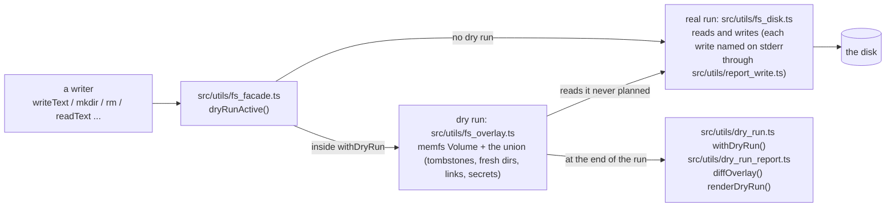

# Dry-run filesystem

How `--dry-run` keeps every read and write of a command on one seam, so a dry run reads the state it planned and prints a diff of it. This page owns the seam's design and its API. Not a user guide: `--dry-run` itself is documented with the commands that take it.

## Two eras

Before the facade, every managed write was a plan: a writer computed a `WritePlan` (the files it touched, attribute by attribute, plus the step that landed them) and handed it to `landPlan`. A dry run recorded the plans, shadowed their content for the run's later readers, and one renderer folded and printed them. Every writer carried the plan vocabulary, and a read that forgot the shadows saw the disk.

With the facade, a writer reads, computes, and writes, every filesystem call going through `src/utils/fs_facade.ts`. A dry run routes reads and writes alike to an overlay (`src/utils/fs_overlay.ts`), a memfs volume unioned with the disk, and prints a tree diff of the overlay against the disk at the end. No plan objects, no shadows, no second code path.

The Claude settings writer in both eras:

```text
before the facade:
  return {
    files: [{
      path: settingsPath,
      verdict: textVerdict(before, text),
      attributes: planPatch(doc, ops, SETTINGS_SECRETS),
      before,
      content: text,
    }],
    apply() {
      mkdirReported(claudeHome);
      writeFileReported(settingsPath, text, { detail });
    },
  };

with the facade:
  fs.mkdir(claudeHome);
  fs.writeText(settingsPath, text, { secretKeys: SETTINGS_SECRETS, detail });
```

## One seam



`src/utils/fs_disk.ts` is the one file in `src/` that touches the disk, reads included; the overlay and the report read the disk through it. It names each write on stderr through `src/utils/report_write.ts`: once per path (a delete re-arms it), and silent inside copilot-env's own homes and under a scratch directory.

The seam is synchronous and node:fs-shaped: the codes on the thrown errors (`ENOENT`, `EEXIST`, `EISDIR`, `ENOTDIR`, `ENOTEMPTY`, `ERR_FS_EISDIR`) are the platform's own, so a caller's catch logic reads the same in both modes.

Demonstrated by: [test/fs_facade.test.ts](../test/fs_facade.test.ts).

Two lint rules in `test/lint/no_unreported_fs_writes.ts` keep it the one seam: `no-unreported-fs-writes` refuses a raw node:fs or Deno write anywhere else in `src/`, and `no-raw-fs-reads` refuses a raw read (a file handle included, whatever its flags).

Both rules exempt `fs_disk.ts`, the dry-run marker, the lock protocol, the preload that patches the proxy's stream, and `src/migrations/`. The read rule also exempts `src/usage/` (partial reads through a fd on the `agent cost` hot path, over inputs no dry run touches) and the preload that runs before the seam exists.

## The API

Every module under `src/` reads and writes files through `import * as fs from "../utils/fs_facade.ts"`. The API is its export list: [src/utils/fs_facade.ts](../src/utils/fs_facade.ts).

Secrets are declared at the write. `secretKeys` names the dotted leaves of a JSON or TOML file whose values print as `<redacted>` for the path's whole run; `secret: true` marks the whole file (a settings bundle, the Codex `config.toml` with a baked key, the Claude Desktop config), which prints its verdict alone.

A declaration travels with the file through `rename` and `copyFile`, and outlives a deletion of the path within the run. Nothing is redacted at read time.

The stderr ledger stays in `src/utils/report_write.ts`: `reportWrite` (a mutation made through another API), `hideWritesUnder`, `deferWriteReports`, `flushWriteReports`. The marker a dry run hands its children (`COPILOT_ENV_DRY_RUN`, `underDryRunMarker`, `spawnedByDryRun`) lives in `src/utils/dry_run.ts` beside `withDryRun`, with `PLANNED_SECRET` (the stand-in a dry run lands for a login it never runs) and `promptRefusedInDryRun`.

## The overlay

A dry run writes into a memfs `Volume` (npm `memfs`, Apache-2.0): the planned bytes, links, directories and listings are its. Everything that joins the volume to the disk is ours, in `src/utils/fs_overlay.ts`, because memfs knows nothing of the disk: the walk that resolves a path one component at a time against planned links and disk links, the tombstones, the fresh-directory shadowing, the modes, and the per-platform errno table.

| The run did               | A later read sees                                                                                                                                                 |
| ------------------------- | ----------------------------------------------------------------------------------------------------------------------------------------------------------------- |
| `writeText(p)`            | the planned text; `stat` reports its size, and the disk's mode unless the write named one, `p` is new, or the write is staged (a fresh inode at the default mode) |
| `rm(p)` (a tombstone)     | nothing: `readText` is `ENOENT`, `exists` false, `readdir` of the parent omits it                                                                                 |
| `rm -r d; mkdir d`        | an empty `d`: a directory made fresh hides everything the disk holds under it                                                                                     |
| `chmod(p)` on a disk file | the disk's bytes, loaded into the volume, with the new mode                                                                                                       |
| `rename(a, b)`            | `b` holds the whole subtree of `a` (planned text, disk files loaded by value, links as links), `a` is gone                                                        |
| `readdir(d)`              | the disk's names, plus the volume's, minus the tombstones                                                                                                         |

A directory the volume holds only as a planned entry's ancestor (the disk's own `~/.codex` under a planned `config.toml`) is no row, and the disk still speaks below it. A disk entry the run carries (a chmod, a rename, a copy) is loaded into the volume by value; its bytes are never decoded, and the report prints its verdict alone.

Four memfs facts the union answers for:

- `rmSync` and `renameSync` follow a link at the path, so a link is removed with `unlinkSync` and moved as its target text.
- It enforces permission bits (a `0444` file refuses a write; a directory without execute bits, which is every folded Windows directory, refuses traversal), and the run simulates no permission failure: the volume keeps memfs's default modes and the overlay records the mode each entry reports.
- On win32 it strips a drive letter it is handed, so a key maps to `/C:/...` inside the volume and the seam's own path handling stays.
- Importing it builds a default volume that asks the process for its uid, so it is loaded inside `withDryRun`, never at import.

Errors the planned state alone determines are mirrored with the platform's own codes and syscall names: a write onto a planned directory is `EISDIR`, a `mkdir` under a planned file `ENOTDIR`, an `rm` of a tombstoned path `ENOENT`, a rename into its own subtree `EINVAL`, a chain of more than forty links `ELOOP`. Tests pin the `code`, never memfs's message text.

A rename onto an existing destination replaces it without a refusal: every writer moves onto a path it has cleared or that was never there.

Windows differs where its node:fs does: a lookup under a file is `ENOENT`, a staged write onto a directory surfaces the `RenameRefusedError` the installer answers. The code Windows raises for a rename whose destination parent is a file is unverified; no writer issues one.

Modes land as Deno lands them: a file's explicit mode exactly, a directory's and every default with the umask applied. Windows keeps one bit: `0666` for anything writable, `0444` otherwise, so a `chmod 0700` there is no change.

Keys are canonical paths, so an alias and its target are one entry and a read through either sees the planned state; a staged write lands over the link itself. The report prints the path the run spelled.

On Windows a key is folded to lower case, so `C:\Temp\File` and `c:\temp\FILE` are one entry. A listing prints each entry's own name (the disk's spelling, or the run's for a planned entry), and `realpath` returns the OS's own spelling of the part the disk holds.

A link the run plans (`symlink`, `atomicSymlink`, or a disk link a `rename` moves) is a link in the volume: a lookup through it restarts at its target, `lstat` and `readdir` see the link, and `readlink` reads its target text. The report says `create`, `rewrite` (anything else at the path), or `same` (a disk link with the same target).

**Accepted residual:** permission-class failures (`EACCES`, `ENOSPC`) are not simulated. A dry run reports what the real run would attempt; at most one cheap access probe may be added, nothing more.

## The report is a tree diff

At the end of the run every touched path is compared with the disk, in first-touch order (an entry a tree removal dropped and a later write re-created takes the later place). The before-text is the disk's, the after-text the volume's.

- **Verdict** per path: `create`, `rewrite`, `same` (printed `unchanged`), `delete`; a directory carries a trailing separator. A file rewritten with its own bytes is `same`; a mode-only change is a `rewrite` with no row; a path created and deleted within the run prints nothing; a tree removed is one `delete` row, whatever the run removed below it first; a moved tree lists every entry under its new name.
- **Attribute rows** for `.json` and `.toml` files: every leaf keyed by dotted path (`model_providers.copilot-env.base_url`, `env.ANTHROPIC_BASE_URL`) with status `set`, `change`, `same`, or `remove`, printed as `key  old -> new`. A writer names the keys to redact on its write (`secretKeys`); those print `<redacted>` for the path's whole run.
- **Text rows** for every other planned text (an rc block, a helper script): the changed lines as `- old` and `+ new`; past 40 changed lines, a count. A declared-secret file with no leaf rows, a file declared `secret` as a whole, a planned link, a byte write, and a disk file the run carried print their verdict alone.
- **Nothing touched** prints `Nothing would be written.`

`src/commands/dry_run.ts` runs a command's body under the marker and `withDryRun`, prints the rendered rows wrapped to the terminal, and rethrows a body's failure after printing what it planned before failing. A child this CLI spawns under a dry run (a probe's auth helper) finds the marker and runs the same way, printing nothing (`src/cli.ts`).
